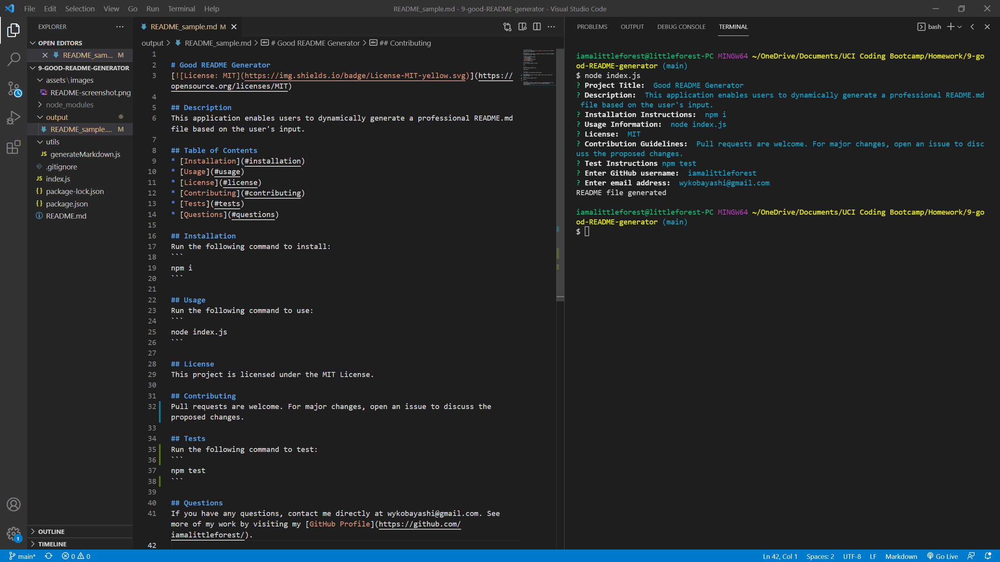

# Good README Generator

## Languages & Technologies
* Javascript
* Node.js
* Inquirer Package

## Description
An application that enables users to dynamically generate a professional README.md file based on the user's input.

## Screenshot

## Demo
[Walkthrough Video](https://iamalittleforest.github.io/9-good-README-generator/assets/images/README-walkthrough.mp4)

## License
MIT License

## Contact Information
Wendy Kobayashi (<wykobayashi@gmail.com>)